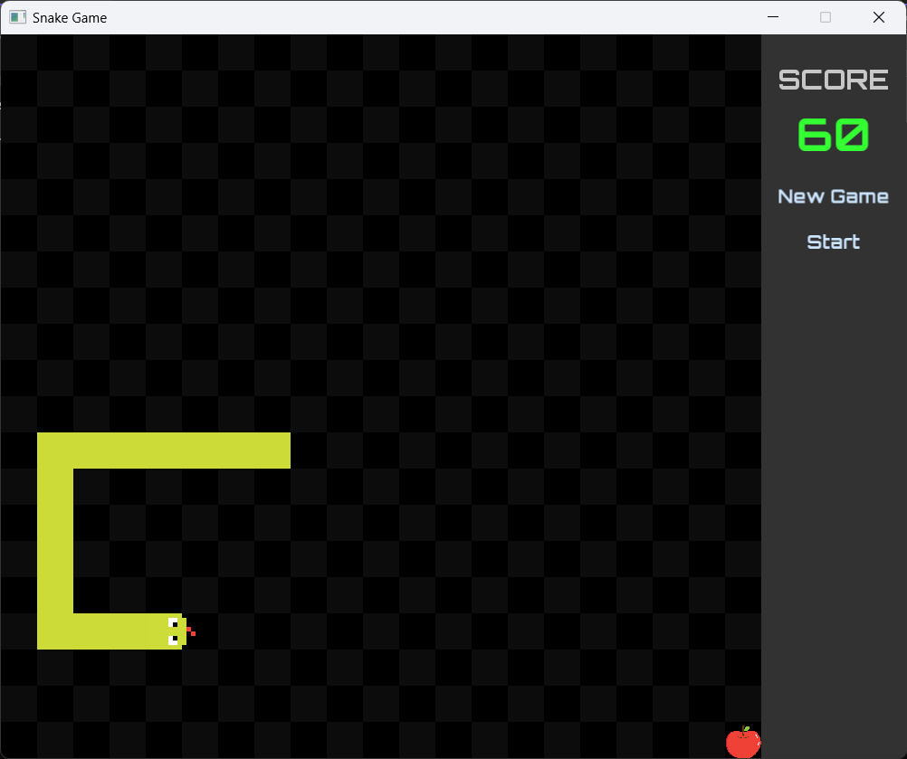

# Snake Game

A simple Snake game built using **C++**, **CMake**, and **SFML 2.6**. This game is a classic implementation of the Snake game, where the player controls a snake to collect food while avoiding obstacles and the snake's own tail. The game includes various controls for movement and interaction.

## Screenshots


## Author
**Ashish Shukla**

## Table of Contents
- [Features](#features)
- [Controls](#controls)
- [Requirements](#requirements)
- [Build Instructions](#build-instructions)
- [How to Run](#how-to-run)
- [Project Structure](#project-structure)
- [Contributing](#contributing)
- [License](#license)

## Features
- **Classic Snake Game**: Grow the snake by eating food, avoid collisions with walls or the snake's body.
- **Customizable Controls**: Modify the controls using the `snake.cpp`.
- **Cross-Platform**: Can be built and run on multiple platforms using **CMake** and **SFML**.

## Controls

The game uses simple keyboard controls:

| Control  | Action           |
|----------|------------------|
| Arrow Up | Move Up          |
| Arrow Down | Move Down      |
| Arrow Left | Move Left      |
| Arrow Right | Move Right    |

You can customize the controls in `snake.cpp`.

## Requirements

- **SFML 2.6**: Ensure you have SFML 2.6 installed on your system.
- **CMake**: CMake is used to build the project.
- **C++ Compiler**: A C++17 compatible compiler (such as g++, clang++, or MSVC).

## Build Instructions

1. **Clone the Repository**:
    ```bash
    git clone https://github.com/AshiShukla/snakeGame.git
    cd snakeGame
    ```

2. **Install SFML**:
    - **Windows**: Download and install SFML 2.6 from the [official website](https://www.sfml-dev.org/download.php).
    - **Linux/macOS**: You can install SFML using package managers like `apt`, `brew`, or `dnf`. For example, on Ubuntu:
      ```bash
      sudo apt-get install libsfml-dev
      ```

3. **Configure with CMake**:
    ```bash
    mkdir build
    cd build
    cmake ../
    ```

    Make sure to set the path to SFML during the configuration if it's not found automatically:
    ```bash
    cmake .. -DSFML_DIR=/path/to/SFML
    ```

4. **Build the Project**:
    ```bash
    cmake --build .
    ```

    This will generate the executable for the Snake game.

## How to Run

After the build completes, you can run the game with:

```bash
./snake   # On Linux/macOS
snake.exe # On Windows
```

Make sure the SFML dynamic libraries (DLLs on Windows or shared objects on Linux) and the `assets` folder are accessible during runtime. You can either copy them to the executable directory or set them in your system's library path.

## Project Structure

The key files in this project are:

- `CMakeLists.txt`: The CMake configuration file.
- `snake.cpp`: The main file containing the game logic.
- `controls.cpp`: Contains the controls logic (button labels and key handling).
- `controls.hpp`: The header file for controls.

```
/SnakeGame
│
├── CMakeLists.txt         # CMake build file
├── snake.cpp              # Main game logic
├── controls.cpp           # Controls implementation (button labels, etc.)
├── controls.hpp           # Controls header
├── assets/                # (Optional) folder for images, fonts, and sound assets
└── README.md              # Project documentation
```

## Contributing

Contributions are welcome! If you'd like to contribute, please fork the repository, make your changes, and submit a pull request. For significant changes, please open an issue first to discuss what you would like to change.

### How to Contribute

1. Fork the repository
2. Create a new branch (`git checkout -b feature-branch`)
3. Make your changes
4. Commit your changes (`git commit -m 'Add some feature'`)
5. Push to the branch (`git push origin feature-branch`)
6. Open a pull request

## License

This project is licensed under the MIT License. See the [LICENSE](LICENSE) file for details.
